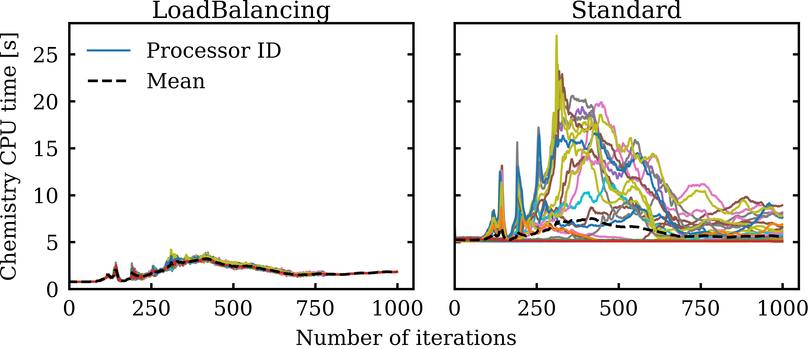

# Foam-Aalto: LoadBalancedChemistryModel


An OpenFOAM chemistry model introducing dynamic load balancing for chemistry calculation
in parallel simulations.

## Why do I need this?

Load imbalance in parallel reactive simulations is an issue that causes very long
simulation times in OpenFOAM simulations utilizing finite-rate chemistry.

LoadBalancedChemistryModel introduces runtime load balancing through MPI routines
to minimize the load imbalance between ranks and gain speed-up. The implementation
details can be found in our paper [[1]](#1).


<p align="center">
    
    <br>
    <em>Figure: A demonstration of how load balancing model works compared to standard model.</em>
</p>


## Compilation

LoadBalancedChemistryModel does not require any third-party dependency.
After sourcing OpenFOAM-8, simply execute:

```
./Allwmake
```

## Usage

Check the tutorials given in tutorials folder.

## Citation

If you use our model, please cite the publication describing its implementation [[1]](#1). 

## References
<a id="1">[1]</a> 
Tekgul, Peltonen, Kahila, Vuorinen (2020). 
[A very cool paper name for this repository](https://www.youtube.com/watch?v=dQw4w9WgXcQ)
Somejournal, xx-xx.


