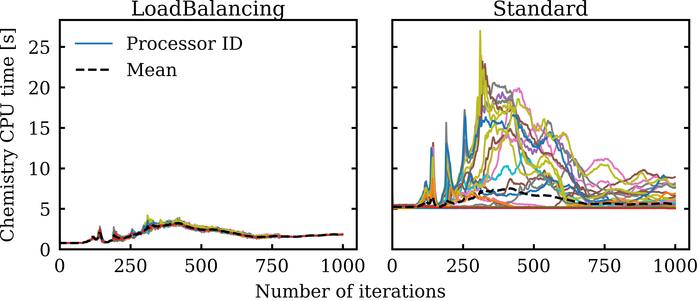

# Foam-Aalto: LoadBalancedChemistryModel


An OpenFOAM chemistry model introducing dynamic load balancing and a zonal reference mapping
filter for chemistry calculation in parallel simulations.

## Why do I need this?

Load imbalance in parallel reactive simulations is an issue that causes very long
simulation times in OpenFOAM simulations utilizing finite-rate chemistry.

LoadBalancedChemistryModel introduces runtime load balancing through MPI routines
to minimize the load imbalance between ranks and gain speed-up. The implementation
details can be found in our paper [[1]](#1).


<p align="center">
    
    <br>
    <em>Figure: A demonstration of how load balancing model works compared to standard model.</em>
</p>


## Compilation

LoadBalancedChemistryModel does not require any third-party dependency.
After sourcing OpenFOAM-8, simply execute:

```
./Allwmake
```

## Usage

Once the compilation is successful, any case running with standard OpenFOAM can be easily converted to
use LoadBalancedChemistryModel, following these steps:

* The LoadBalancedChemistryModel should be linked to the solver. Add the following to your system/controlDict file:

```
libs
(
    "libchemistryModel_Aalto.so" 
);
```

* Select chemistry solver method as loadBalanced in constant/chemistryProperties:

```
chemistryType
{
    solver          ode;
    method          loadBalanced;
}
```

* Add the loadbalancing subdictionary to the same chemistryProperties file:

```
loadbalancing
{
    active true;
    log	true;
}
```

* (Optional) Add the refmapping subdictionary to chemistryProperties file if you want to 
    use the reference mapping method:

```
refmapping
{
    active  true;
    
    mixtureFractionProperties
    {
        oxidizerMassFractions
        {
            N2       0.77;
            O2       0.23;
        }

        fuelMassFractions
        {
            NC12H26       1.0;
        }

        #include "$FOAM_CASE/constant/thermo.compressibleGasGRI"
    }
    tolerance	1e-4;  // mixture fraction tolerance
    deltaT	2; // temperature tolerance
}
```
Reference mapping uses mixture fraction (Z) and maps a reference solution to reference
cells satisfying a condition.

The entry above sets the Z=0 and Z=1 conditions from given mass fractions. For each
CFD iteration it finds a reference solution where Z<tolerance and solves the chemistry.
Subsequent cells following the same condition are mapped from this reference solution.

Optional: When deltaT is explicitly set, the mapper also checks the temperature
between reference solution and other reference cells and ensures:
abs(T<sub>cell</sub>-T<sub>ref</sub>)<deltaT.


* Run the case with normally with OpenFOAM's reactive solvers.

For a working example, check the tutorials given in tutorials folder.

## Citation

If you use our model, please cite the publication describing its implementation [[1]](#1). 

## References
<a id="1">[1]</a> 
Tekgul, Peltonen, Kahila, Vuorinen (2020). 
[A very cool paper name for this repository](https://www.youtube.com/watch?v=dQw4w9WgXcQ)
Somejournal, xx-xx.


